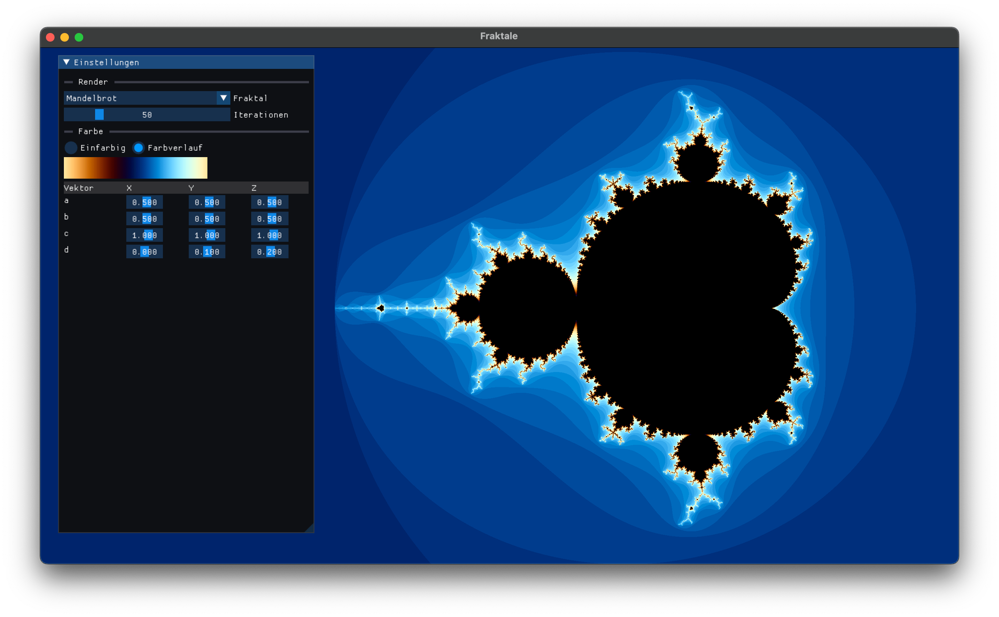
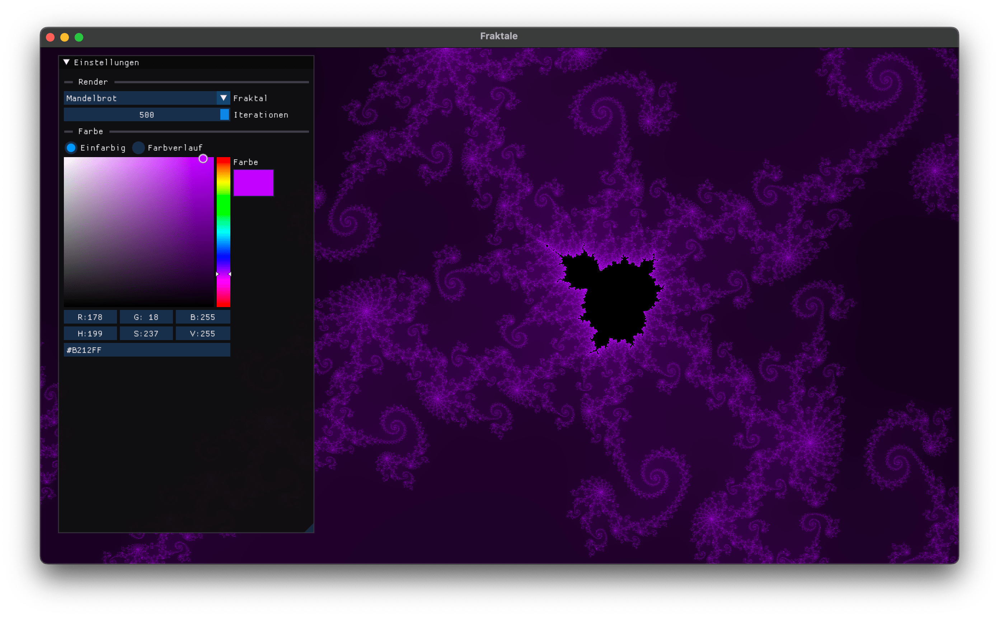
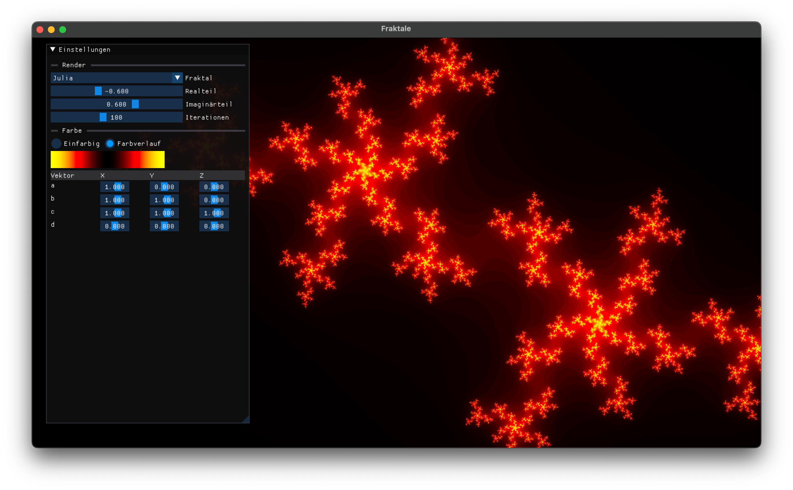
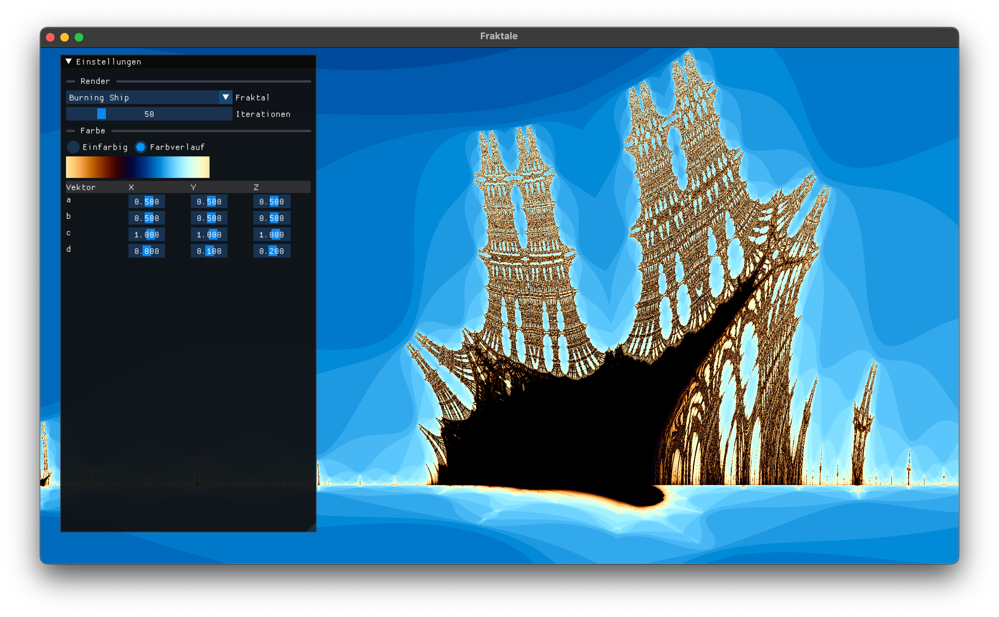

# Fraktale

Dieses Projekt ist ein Programm zur Visualisierung von Fraktalen, das im Rahmen meiner Komplexen Leistung erstellt wurde. Mit OpenGL und ImGui können Benutzer verschiedene Arten von Fraktalen erkunden und rendern.

<table>
  <tr>
    <td align="center">
      
    </td>
    <td align="center">
      
    </td>
  </tr>
  <tr>
    <td align="center">
      
    </td>
    <td align="center">
      
    </td>
  </tr>
</table>

## Features

- Wählen Sie zwischen verschiedenen Fraktaltypen: Mandelbrot, Julia und Burning Ship.
- Passen Sie die Anzahl der Iterationen für die Darstellung an.
- Passen Sie Farbschemata für die Fraktale an.
- Echtzeitvorschau von Fraktalen mit benutzerfreundlichen Steuerelementen.
- Interaktive Benutzeroberfläche mit ImGui zur Anpassung von Parametern.

## Bibliotheken

Dieses Projekt basiert auf folgenden Bibliotheken und Werkzeugen:

-  [CMake](https://cmake.org/): An open-source, cross-platform build system.
-  [CMakeRC](https://github.com/vector-of-bool/cmrc): A Resource Compiler in a Single CMake Script.
-  [GLFW](https://www.glfw.org/): A multi-platform library for creating windows with OpenGL contexts.
-  [GLEW](http://glew.sourceforge.net/): The OpenGL Extension Wrangler Library for easier handling of OpenGL extensions.
-  [GLM](https://github.com/g-truc/glm): A header-only C++ mathematics library for graphics software based on the OpenGL Shading Language (GLSL) specifications.
-  [ImGui](https://github.com/ocornut/imgui): A Bloat-free Immediate Mode Graphical User interface for C++ with minimal dependencies.
